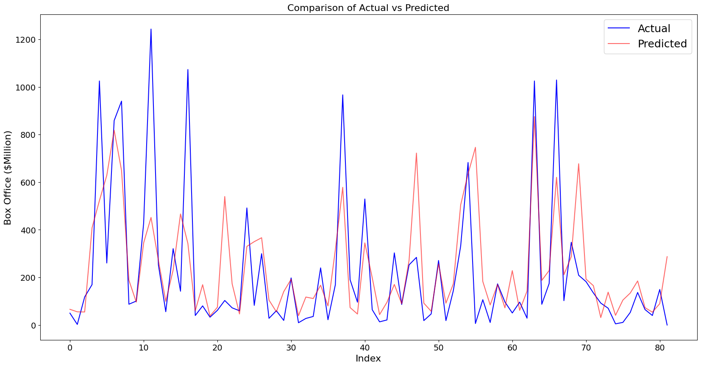

# Disney Movie Data Scrape
In this project, I complete steps to create a dataset from scratch and utilize it to predict Box Office revenue. The dataset contains all the information found on each Disney movies' Wikipedia information box.
    Movie List: https://en.wikipedia.org/wiki/List_of_Walt_Disney_Pictures_films

## Libraries/Helpers
- Data Scraping: BeautifulSoup, Requests
- Save/Load Files: JSON, Pickle, CSV, Pandas
- API: The Open Movie Database (http://www.omdbapi.com)
- Plotting/Modelling: matplotlib, seaborn, scikit-learn
- Others: urllib, os, datetime, RegEx

Pytest from [helper](https://github.com/marcowong3/scrape-disney-movie/tree/main/helper) was used in Task 3 to convert monetary strings to numerical values

##  Dataset Creation Tasks Outline
Task 1: Build a script to access the information box found on a movie's Wikipedia page.   
Task 2: Build a script to access all movies' information box found in Movie List url.  
Task 3: Clean Data, Test Code with Pytest  
Task 4: Attach IMDB/Rotten Tomatoes/Metascore Scores  
Task 5: Remove Junk Columns  
Task 6: Save final data as CSV/Pickle  

The final datasets ready for analysis are formatted as CSV and Pickle are found at [this folder](https://github.com/marcowong3/scrape-disney-movie/tree/main/disney_data_final)  

##  Dataset Analysis Tasks Outline
- Data Exploration
- Statistical Analysis
- Box Office Modelling (Using Running time, Budget,	imdb,	Metascore,	RottenTomato,	Release Year)

## Result

